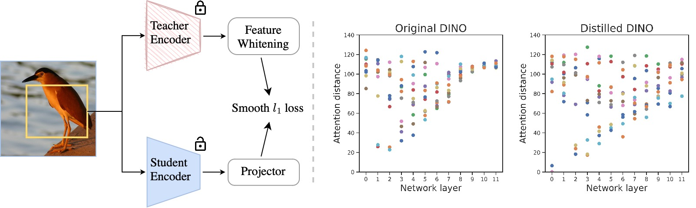

# Feature-Distillation

By [Yixuan Wei](https://scholar.google.com/citations?user=xwudKb4AAAAJ&hl=en)\*, [Han Hu](https://ancientmooner.github.io/)\*, [Zhenda Xie](https://zdaxie.github.io), [Zheng Zhang](https://stupidzz.github.io/), [Yue Cao](http://yue-cao.me), [Jianmin Bao](https://jianminbao.github.io/), [Dong Chen](http://www.dongchen.pro) and [Baining Guo](https://scholar.google.com/citations?user=h4kYmRYAAAAJ&hl=en&oi=ao).

This repo is the official implementation of ["Contrastive Learning Rivals Masked Image Modeling in Fine-tuning via Feature Distillation"](https://arxiv.org/abs/2205.14141).

## Updates
***11/28/2022***

Initial commits:

1. Distilled and fine-tuned models on ImageNet-1K (`Swin Base`, and `ViT Base`) are provided.
2. The supported code for ImageNet-1K distillation and fine-tuneing is provided.

## Introduction

**FD** is initially described in [arxiv](https://arxiv.org/abs/2205.14141), which is a simple framework to convert the traditional pre-training models, such as image classification (DeiT), instance contrastive learning (DINO) and image-text alignment (CLIP) into new models with better fine-tuning performances. Through a set of diagosing tools, we find that the models distilled with feature map are endowed with following good properties which are also revealed in masked image modeling models: 1) more diverse attention heads; 2) more diagonal attention patterns; 3) flatten loss landscapes. 

<div align="center">
    
</div>

## Main Results on ImageNet

### Swin Transformer

**ImageNet-1K Pre-trained and Fine-tuned Models**

| name | pre-train epochs | teacher model | image resolution | acc@1 | pre-trained model | fine-tuned model |
| :---: | :---: | :---: | :---: | :---: | :---: | :---: |
| Swin-Base | 300 | [EsViT-Base](https://github.com/microsoft/esvit) | 224x224 | 85.1 | [google](https://drive.google.com/file/d/11_GQUHgcrUO8PMzl73eJmLSa7f3c5dZY/view?usp=sharing)/[config](configs/pretrain/fd_pretrain__esvit_swin_base__img224__300ep.yaml) | [google](https://drive.google.com/file/d/1criliGcjpEJxqlsYRGBERBAMYrFYFW--/view?usp=sharing)/[config](configs/finetune/fd_finetune__esvit_swin_base__img224__300ep.yaml) |

### Vision Transformer

**ImageNet-1K Pre-trained and Fine-tuned Models**

| name | pre-train epochs | teacher model | image resolution | acc@1 | pre-trained model | fine-tuned model |
| :---: | :---: | :---: | :---: | :---: | :---: | :---: |
| ViT-Base | 300 | [CLIP-Base](https://github.com/openai/CLIP) | 224x224 | 84.9 | [google](https://drive.google.com/file/d/1XFOZ6rJkv5X08Bu5d04_Xy3iJOj6SLc7/view?usp=sharing)/[config](configs/pretrain/fd_pretrain__clip_vit_base__img224__300ep.yaml) | [google](https://drive.google.com/file/d/1mP_JESmcdFeIkpB4aYyFzALtkydy_9qN/view?usp=sharing)/[config](configs/finetune/fd_finetune__clip_vit_base__img224__300ep.yaml) |
| ViT-Base | 300 | [DINO-Base](https://github.com/facebookresearch/dino) | 224x224 | 83.8 | [google](https://drive.google.com/file/d/1fwBINMxpv5zFOI7Ye6l9msI8GzocpA3z/view?usp=sharing)/[config](configs/pretrain/fd_pretrain__dino_vit_base__img224__300ep.yaml) | [google](https://drive.google.com/file/d/1Mn_GgepfZXOe7W0UqEQMFo5MjJpMwM_i/view?usp=sharing)/[config](configs/finetune/fd_finetune__dino_vit_base__img224__300ep.yaml) |
| ViT-Base | 300 | [DeiT-Base](https://github.com/facebookresearch/deit) | 224x224 | 83.0 | [google](https://drive.google.com/file/d/1yPezioDc4O6hdfD6VSAIU9DvJiXG4ZSJ/view?usp=sharing)/[config](configs/pretrain/fd_pretrain__deit_vit_base__img224__300ep.yaml) | [google](https://drive.google.com/file/d/1pb0KUlVcCaEGT-xnx6ookrqcC-88Ori5/view?usp=sharing)/[config](configs/finetune/fd_finetune__deit_vit_base__img224__300ep.yaml) |

## Citation

If you find our work useful in your research, please cite:

```
@article{wei2022FD,
  title={Contrastive Learning Rivals Masked Image Modeling in Fine-tuning via Feature Distillation},
  author={Yixuan Wei and Han Hu and Zhenda Xie and Zheng Zhang and Yue Cao and Jianmin Bao and Dong Chen and Baining Guo},
  journal={Tech Report},
  year={2022}
}
```

## Getting Started

### Installation

- Install `CUDA 11.3` with `cuDNN 8` following the official installation guide of [CUDA](https://docs.nvidia.com/cuda/cuda-installation-guide-linux/index.html) and [cuDNN](https://developer.nvidia.com/rdp/cudnn-archive).

- Setup conda environment:
```bash
# Create environment
conda create -n FD python=3.8 -y
conda activate FD

# Install requirements
pip install torch==1.12.0+cu113 torchvision==0.13.0+cu113 torchaudio==0.12.0 --extra-index-url https://download.pytorch.org/whl/cu113

# Clone codes
git clone https://github.com/SwinTransformer/Feature-Distillation
cd Feature-Distillation

# Install other requirements
pip install -r requirements.txt
```

### Feature-Distillation
To distillation models, run:
```bash
python -m torch.distributed.launch --nproc_per_node <num-of-gpus-to-use> main_fd.py \ 
--cfg <config-file> --data-path <imagenet-path>/train [--batch-size <batch-size-per-gpu> --output <output-directory> --tag <job-tag>]
```

For example, to distill `CLIP-Base` for 300 epochs on one DGX-2 server, run:
```bash
python -m torch.distributed.launch --nproc_per_node=16 main_fd.py --cfg configs/pretrain/fd_pretrain__clip_vit_base__img224__300ep.yaml --batch-size 128 --data-path <imagenet-path>/train [--output <output-directory> --tag <job-tag>]
```

If you want to save gpu memory consumption, add `--use-checkpoint`.

### Fine-tuning distilled models
To fine-tune models distilled, run:
```bash
python -m torch.distributed.launch --nproc_per_node <num-of-gpus-to-use> main_finetune.py \ 
--cfg <config-file> --data-path <imagenet-path> --pretrained <pretrained-ckpt> [--batch-size <batch-size-per-gpu> --output <output-directory> --tag <job-tag>]
```

For example, to fine-tune `Distilled-CLIP-Base` on one DGX-2 server, run:
```bash
python -m torch.distributed.launch --nproc_per_node 16 main_finetune.py \ 
--cfg configs/finetune/fd_finetune__clip_vit_base__img224__300ep.yaml --batch-size 128 --data-path <imagenet-path> --pretrained <pretrained-ckpt> [--output <output-directory> --tag <job-tag>]
```